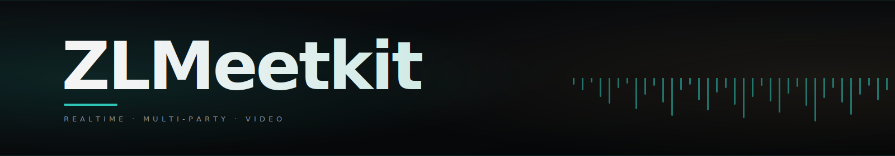
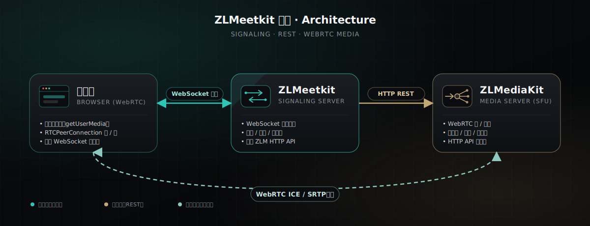
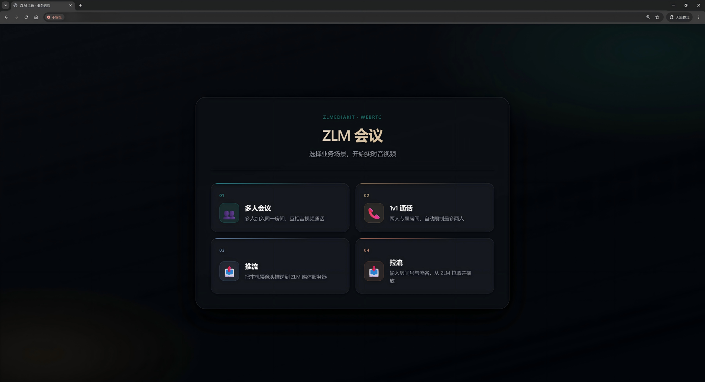

<p align="center">
  
</p>

<p align="center">
  <b>基于 ZLMediaKit · Go · WebRTC 的开源多人视频会议</b><br/>
  <sub>WebSocket 信令 · ZLM HTTP REST 控制 · WebRTC ICE/SRTP 媒体直连</sub>
</p>

<p align="center">
  <a href="./LICENSE"></a>
  <a href="https://golang.org/"></a>
  
  <a href="https://github.com/ZLMediaKit/ZLMediaKit"></a>
  
</p>

<p align="center">
  <a href="#-快速开始">快速开始</a> ·
  <a href="#-架构">架构</a> ·
  <a href="#-功能">功能</a> ·
  <a href="#-界面预览">界面</a> ·
  <a href="#-文档">文档</a> ·
  <a href="#-致谢">致谢</a>
</p>

---

## ✨ 功能

ZLMeetkit 将 ZLMediaKit 作为媒体面、Go 信令服务作为控制面，提供一套**开箱即用**的浏览器多人音视频解决方案。前端纯原生 HTML/JS，无构建步骤。

- **多业务场景** — 多人会议 / 1v1 通话 / 独立推流 / 独立拉流，四种入口由首页统一进入
- **独立媒体流** — 每个用户独立推流（`cam` + 可选 `screen`），其他人各自订阅，互不耦合
- **会议体验** — 麦克风/摄像头热切换、屏幕共享、文字聊天、画质档位切换、双击窗口聚焦布局
- **录制与回放** — MP4 录制本地预览，一键下载，独立录制摄像头或屏幕
- **跨平台** — Linux 与 Windows 均已提供构建/启动脚本
- **零前端构建** — 原生 HTML + ES Module，浏览器直开即用
- **房间即 `app`** — 「房间号」即 ZLM 的 `app`，同房间共享流分组；流名约定 `user_<userId>_<kind>`

## 🚀 快速开始

> 前提：已有一个开启了 WebRTC 与 HTTP API 的 ZLMediaKit 实例。详细配置见 [docs/配置.md](./docs/配置.md)。

### 1. 编译

需要 **Go 1.21+**。脚本会自动初始化 `backend/bin/`、复制配置模板、拉取依赖并编译。

**Linux**

```bash
bash backend/scripts/linux/build.sh
```

**Windows**

```bat
backend\scripts\win\build.bat
```

输出：`backend/bin/ZLMeetServer`（Windows 为 `ZLMeetServer.exe`）。

### 2. 编辑配置

打开 `backend/bin/conf/config.yaml`，按需修改：

| 配置项 | 默认 | 说明 |
|---|---|---|
| `listen` | `:8080` | 信令服务监听地址 |
| `tls_cert` / `tls_key` | `cert/cert.pem` / `cert/key.pem` | TLS 证书；不填则以 HTTP 监听 |
| `static_dir` | `../../frontend` | 前端静态目录 |
| `zlm.api_base` | `http://127.0.0.1:8081` | ZLMediaKit HTTP API 地址 |
| `zlm.secret` | — | ZLMediaKit `general.secret` |

### 3. 启动

**Linux**

```bash
bash backend/scripts/linux/start.sh
```

**Windows**

```bat
backend\scripts\win\start.bat
```

打开 `https://信令服务ip:端口/` 即可看到业务选择页。

### 4. 生成 TLS 证书（局域网 HTTPS）

浏览器仅在 `https://` 或 `http://localhost` 下允许访问摄像头。`build` 脚本已为你创建 `backend/bin/cert/` 目录，将证书放入即可：

```bash
cd backend/bin/cert
openssl req -x509 -newkey rsa:2048 -keyout key.pem -out cert.pem -days 365 -nodes
```

Windows 用户可使用 [Git for Windows](https://git-scm.com/download/win) 自带的 `openssl`，或安装 [Win64 OpenSSL](https://slproweb.com/products/Win32OpenSSL.html)。

证书生成后重启服务，浏览器提示证书不受信任时，选择「高级 → 继续访问」。

## 📦 架构

ZLMeetkit 自身不处理音视频字节流，所有 RTP/SRTP 都由浏览器与 ZLMediaKit **直连**完成。Go 信令服务只做"编排"：房间 / 成员 / 流的生命周期，以及向 ZLM 下发 HTTP API。

<p align="center">
  
</p>

控制面与数据面分离，让信令服务保持极简、易于二次开发：

| 通道 | 协议 | 谁参与 | 用途 |
|---|---|---|---|
| 信令 | WebSocket | 浏览器 ⇄ ZLMeetkit | 房间/成员加入退出、SDP 协商、ICE 候选交换、聊天消息 |
| 控制 | HTTP REST | ZLMeetkit → ZLMediaKit | 创建/关闭流、查询流状态、启动/停止录制 |
| 媒体 | WebRTC ICE / SRTP | 浏览器 ⇄ ZLMediaKit | 音视频数据直连，不经过信令服务 |

## 🎨 界面预览

ZLMeetkit 采用统一的暗色主题（青绿 + 暖金），所有业务共享同一套视觉语言。

**1. 首页 · 业务选择**

<p align="center">
  
</p>

**2. 多人会议**

默认网格自动平铺；双击任意窗口进入「大窗口聚焦 + 侧边缩略图」布局。

<p align="center">
  
  &nbsp;
  
</p>

**3. 1v1 通话**

两人专属房间，自动限制最多两人；支持画中画拖动、切换、聊天与单独录制。

<p align="center">
  
  &nbsp;
  
</p>

**4. 独立推流 / 拉流**

把本机摄像头推送到 ZLM；或从 ZLM 拉取并播放任意流。

<p align="center">
  
  &nbsp;
  
</p>

## 📚 文档

| 文档 | 说明 |
|---|---|
| [业务说明](./docs/业务说明.md) | 四种业务入口、交互流程、功能清单 |
| [开发参考](./docs/开发参考.md) | 项目结构、信令协议、快速排错 |
| [配置](./docs/配置.md) | ZLMediaKit 与信令服务配置说明 |

## 🙏 致谢

感谢 [ZLMediaKit](https://github.com/ZLMediaKit/ZLMediaKit) 及其作者 [夏楚](https://github.com/xia-chu)。

## 📄 License

[MIT](./LICENSE) © ZLMeetkit contributors
